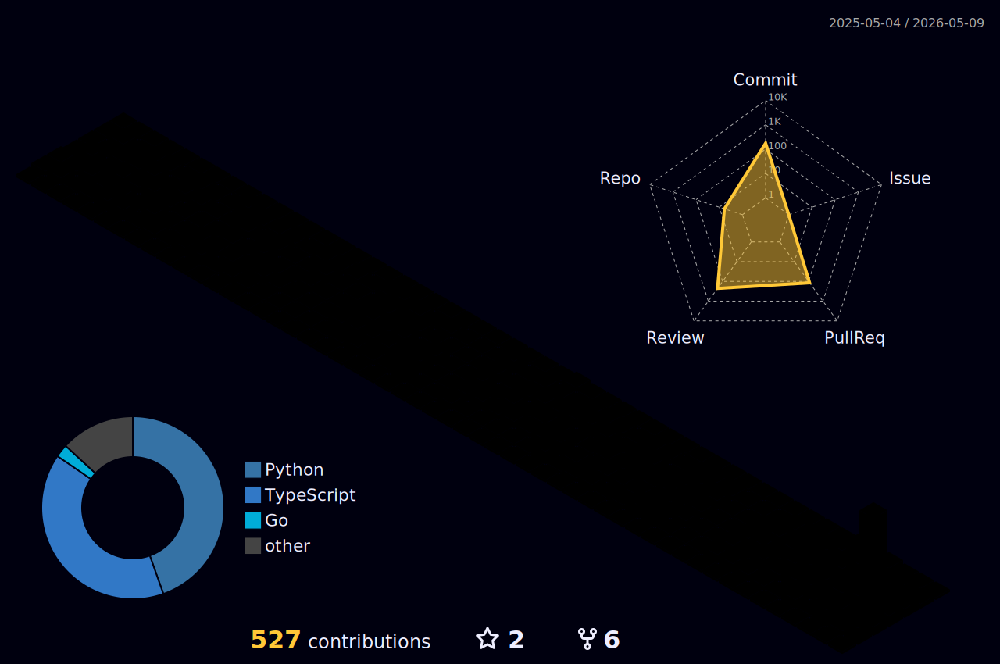

<div align="center">

<picture>
  <source media="(prefers-color-scheme: dark)" srcset="https://readme-typing-svg.demolab.com?font=Orbitron&weight=700&size=36&duration=4000&pause=3000&color=FFFFFF&center=true&vCenter=true&width=600&lines=Juntao+Wang" />
  <source media="(prefers-color-scheme: light)" srcset="https://readme-typing-svg.demolab.com?font=Orbitron&weight=700&size=36&duration=4000&pause=3000&color=1F2328&center=true&vCenter=true&width=600&lines=Juntao+Wang" />
  
</picture>

<picture>
  <source media="(prefers-color-scheme: dark)" srcset="https://readme-typing-svg.demolab.com?font=ZCOOL+QingKe+HuangYou&size=24&duration=4000&pause=3000&color=00D9FF&center=true&vCenter=true&width=300&lines=%E7%8E%8B%E4%BF%8A%E9%9F%AC" />
  <source media="(prefers-color-scheme: light)" srcset="https://readme-typing-svg.demolab.com?font=ZCOOL+QingKe+HuangYou&size=24&duration=4000&pause=3000&color=0550AE&center=true&vCenter=true&width=300&lines=%E7%8E%8B%E4%BF%8A%E9%9F%AC" />
  
</picture>

<picture>
  <source media="(prefers-color-scheme: dark)" srcset="https://readme-typing-svg.demolab.com?font=Fira+Code&size=16&duration=3000&pause=1000&color=00D9FF&center=true&vCenter=true&width=600&lines=Frontend+Engineer+%40+Red+Hat;MLOps+Platforms+%C2%B7+AI%2FML+Tooling+%C2%B7+Open+Source" />
  <source media="(prefers-color-scheme: light)" srcset="https://readme-typing-svg.demolab.com?font=Fira+Code&size=16&duration=3000&pause=1000&color=0550AE&center=true&vCenter=true&width=600&lines=Frontend+Engineer+%40+Red+Hat;MLOps+Platforms+%C2%B7+AI%2FML+Tooling+%C2%B7+Open+Source" />
  
</picture>

<br/>


</div>

---

```diff
+ Vibe coder and AI enthusiast. I believe AI tooling can
+ meaningfully compress the distance between idea and shipped code.
+
+ Not a maximalist — still navigating where AI shines and where
+ human judgment stays irreplaceable. Somewhere between
+ "ship it with Cursor" and "wait, let me actually think about this."
+
+ Exploring the balance between AI-driven velocity and reliability,
+ while staying curious about everything the AI tooling space has to offer.
```

---

<div align="center">

<picture>
  <source media="(prefers-color-scheme: dark)" srcset="https://raw.githubusercontent.com/DaoDaoNoCode/DaoDaoNoCode/output/github-contribution-grid-snake-dark.svg" />
  <source media="(prefers-color-scheme: light)" srcset="https://raw.githubusercontent.com/DaoDaoNoCode/DaoDaoNoCode/output/github-contribution-grid-snake.svg" />
  
</picture>

</div>

<div align="center">

<picture>
  <source media="(prefers-color-scheme: dark)" srcset="./profile-3d-contrib/profile-night-rainbow.svg" />
  <source media="(prefers-color-scheme: light)" srcset="./profile-3d-contrib/profile-green.svg" />
  
</picture>

</div>
